# Android Boot Animations GIFs

A collection of custom and stock Android boot animations converted into high-quality GIFs.

> [!NOTE]  
> **⚠️ The GIF previews are compressed for quick loading and do not represent the actual full FPS smooth transition of the real boot animations.**

## Preview Gallery

<table>
  <tr>
    <td align="center">
      <h3>ASUS ROG</h3>
       
      <code>ASUS-ROG.gif</code>
    </td>
    <td align="center">
      <h3>Augmented Reality</h3>
      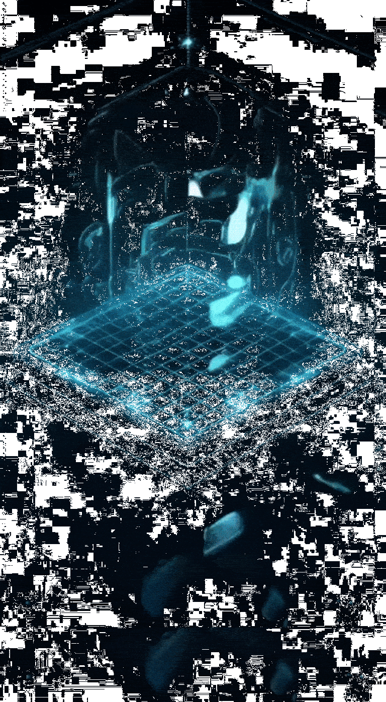 
      <code>Augmented.reality.gif</code>
    </td>
  </tr>
  <tr>
    <td align="center">
      <h3>Corvus</h3>
       
      <code>Corvus.gif</code>
    </td>
    <td align="center">
      <h3>crDroid Android</h3>
       
      <code>crDroidAndroid.gif</code>
    </td>
  </tr>
  <tr>
    <td align="center">
      <h3>CyanogenMod</h3>
      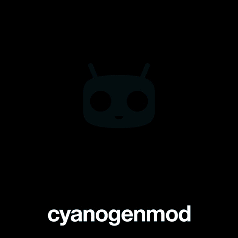 
      <code>CyanogenMod.gif</code>
    </td>
    <td align="center">
      <h3>Cybernetic Circuit</h3>
      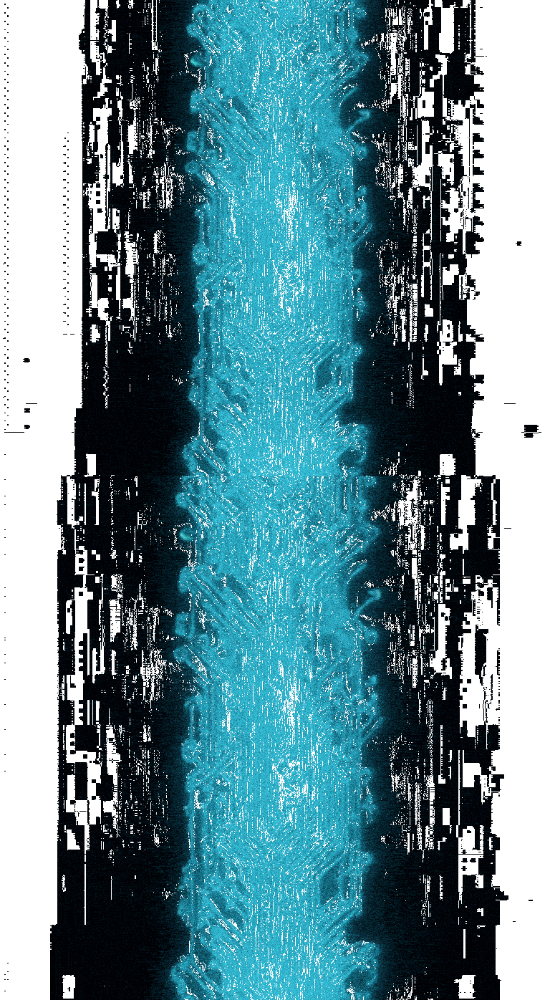 
      <code>Cybernetic.circuit.gif</code>
    </td>
  </tr>
  <tr>
    <td align="center">
      <h3>Cyborg Eye Activation</h3>
      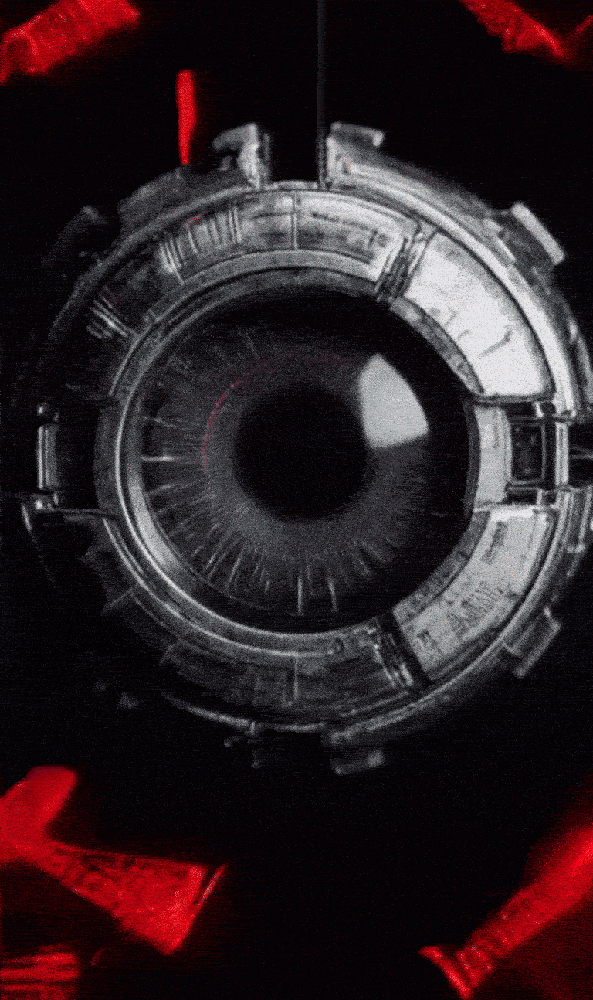 
      <code>Cyborg.eye.activation.gif</code>
    </td>
    <td align="center">
      <h3>Data Core Vertex</h3>
      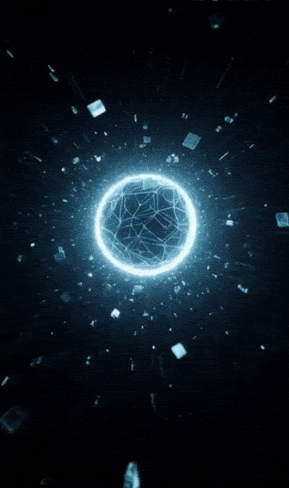 
      <code>Data.core.vertex.gif</code>
    </td>
  </tr>
  <tr>
    <td align="center">
      <h3>Electric Pulse</h3>
      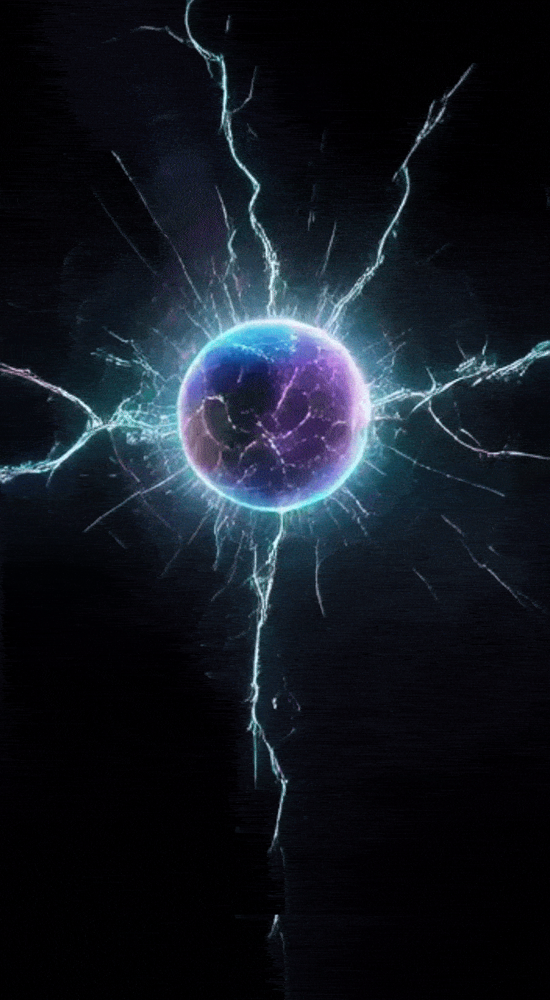 
      <code>electricpulse.gif</code>
    </td>
    <td align="center">
      <h3>Energy Sphere Pulsating</h3>
      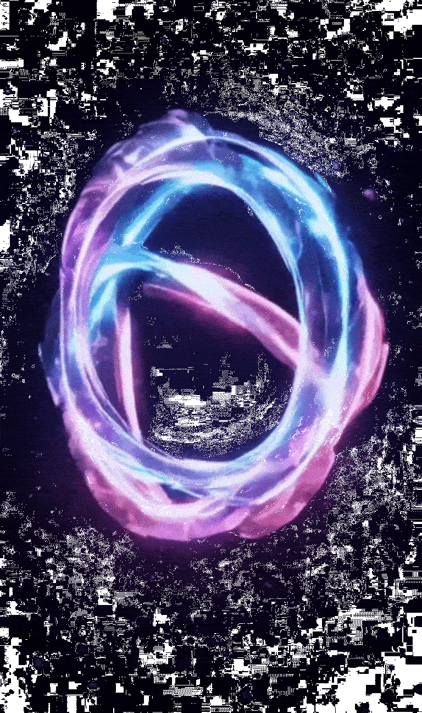 
      <code>Energyspherepulsating.gif</code>
    </td>
  </tr>
  <tr>
    <td align="center">
      <h3>EvolutionX</h3>
       
      <code>EvolutionX.gif</code>
    </td>
    <td align="center">
      <h3>Floating Crystal</h3>
       
      <code>Floating.crystal.gif</code>
    </td>
  </tr>
  <tr>
    <td align="center">
      <h3>Glitches</h3>
      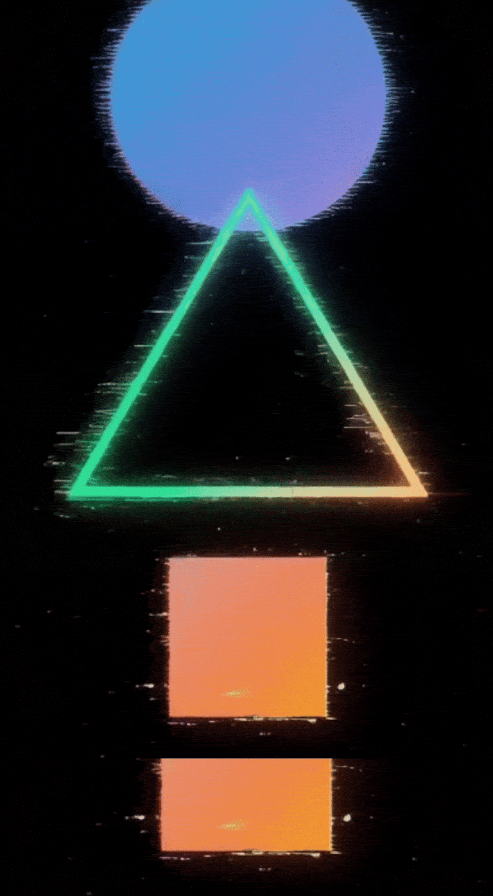 
      <code>Glitches.gif</code>
    </td>
    <td align="center">
      <h3>Google Monet</h3>
       
      <code>Google_Monet.gif</code>
    </td>
  </tr>
  <tr>
    <td align="center">
      <h3>Google Pixel Dark</h3>
      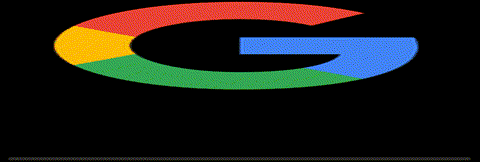 
      <code>Google-pixel-dark.gif</code>
    </td>
    <td align="center">
      <h3>Hacker</h3>
      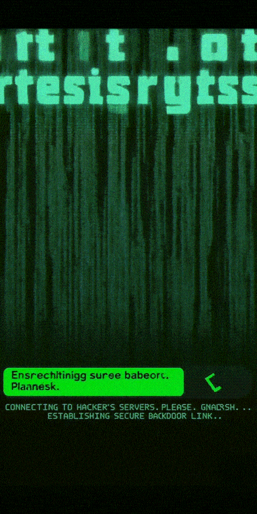 
      <code>hacker.gif</code>
    </td>
  </tr>
  <tr>
    <td align="center">
      <h3>Hacker Terminal Boot</h3>
      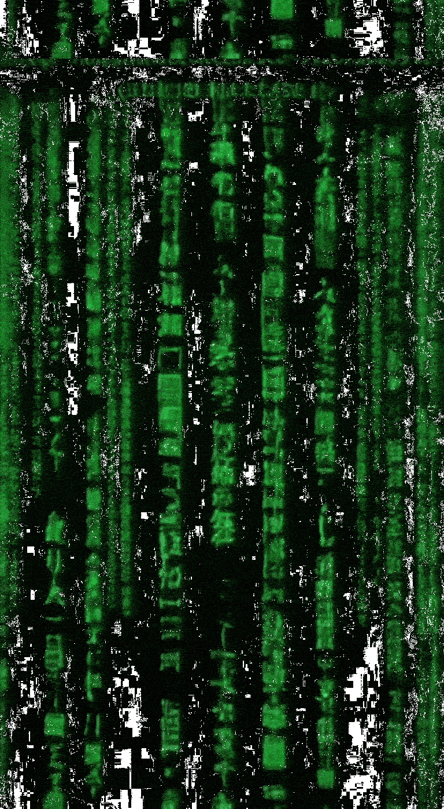 
      <code>Hacker.terminal.boot.gif</code>
    </td>
    <td align="center">
      <h3>Holographic Grid</h3>
      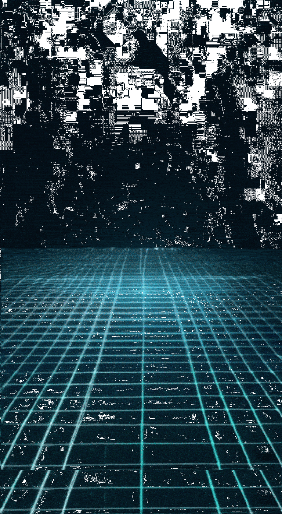 
      <code>Holographicgrid.gif</code>
    </td>
  </tr>
  <tr>
    <td align="center">
      <h3>Hyper OS Glitchy</h3>
      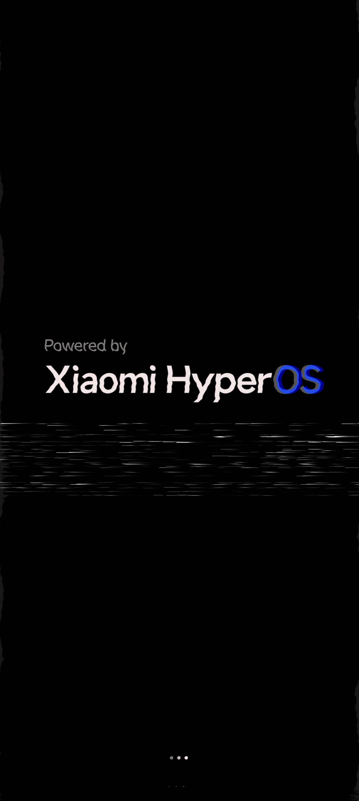 
      <code>Hyper-os-glitchy.gif</code>
    </td>
    <td align="center">
      <h3>iOS Black</h3>
      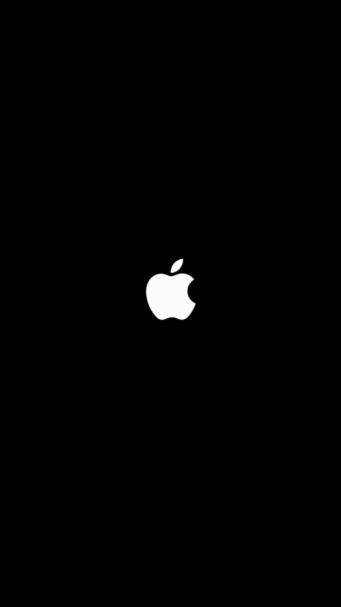 
      <code>IOS-Black.gif</code>
    </td>
  </tr>
  <tr>
    <td align="center">
      <h3>Kali Linux</h3>
       
      <code>Kali-Linux.gif</code>
    </td>
    <td align="center">
      <h3>Matrix Numbers</h3>
       
      <code>matrix-numbers.gif</code>
    </td>
  </tr>
  <tr>
    <td align="center">
      <h3>Matrixx</h3>
       
      <code>Matrixx.gif</code>
    </td>
    <td align="center">
      <h3>Neon Katana</h3>
      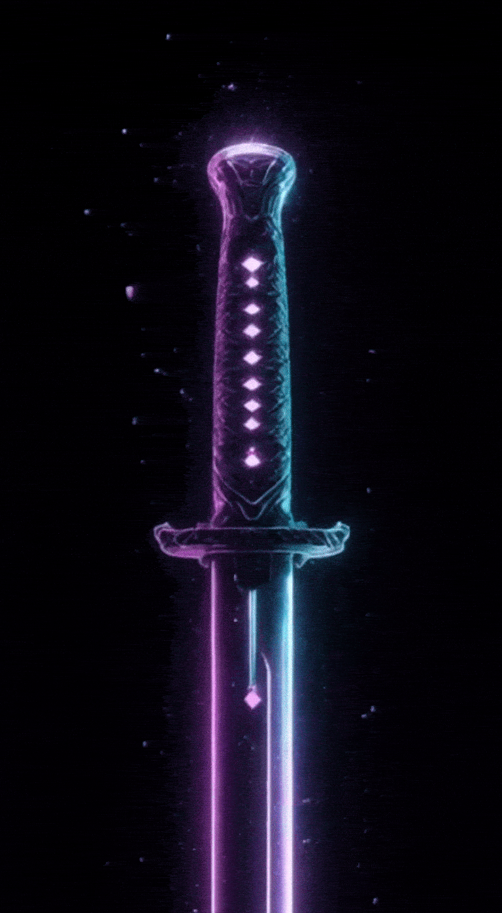 
      <code>Neon.katana.gif</code>
    </td>
  </tr>
  <tr>
    <td align="center">
      <h3>OctaviOS</h3>
      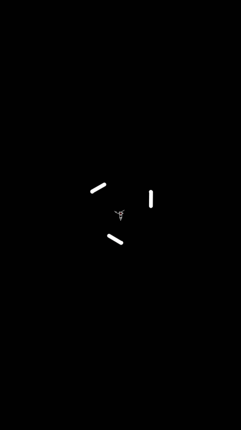 
      <code>OctaviOS.gif</code>
    </td>
    <td align="center">
      <h3>OxygenOS</h3>
       
      <code>OxygenOS.gif</code>
    </td>
  </tr>
  <tr>
    <td align="center">
      <h3>Particle Swarm</h3>
       
      <code>Particle.swarm.gif</code>
    </td>
    <td align="center">
      <h3>Quantum Dots Convergence</h3>
      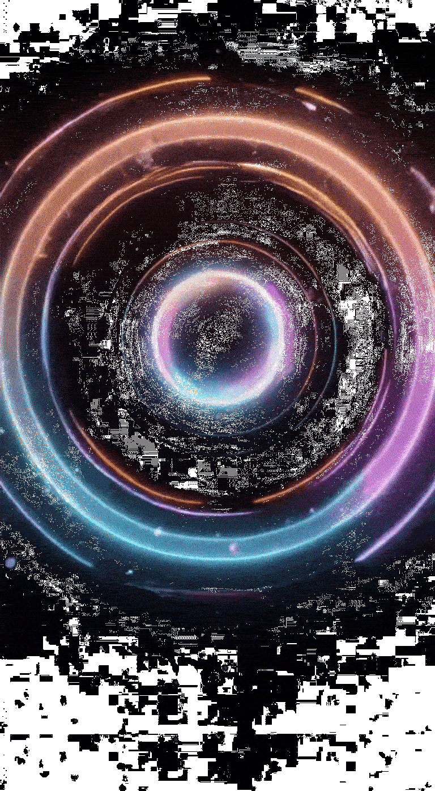 
      <code>Quantum.Dots.Convergence.gif</code>
    </td>
  </tr>
  <tr>
    <td align="center">
      <h3>Resurrection Remix</h3>
       
      <code>Resurrection-remix.gif</code>
    </td>
    <td align="center">
      <h3>RROS Q</h3>
      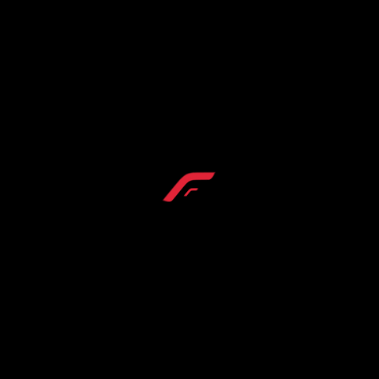 
      <code>RROS-Q.gif</code>
    </td>
  </tr>
  <tr>
    <td align="center">
      <h3>SuperiorOS Fourteen</h3>
      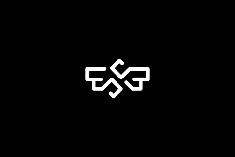 
      <code>SuperiorOS_Fourteen.gif</code>
    </td>
    <td align="center">
      <h3>SuperiorOS</h3>
       
      <code>SuperiorOS.gif</code>
    </td>
  </tr>
  <tr>
    <td align="center">
      <h3>Voltage</h3>
       
      <code>Voltage.gif</code>
    </td>
    <td align="center">
      <h3>Waveform Synchronization</h3>
      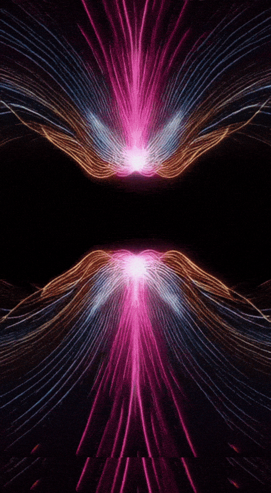 
      <code>Waveform.synchronization.gif</code>
    </td>
  </tr>
</table>

## License

This project is licensed under the MIT License - see the LICENSE file for details.
